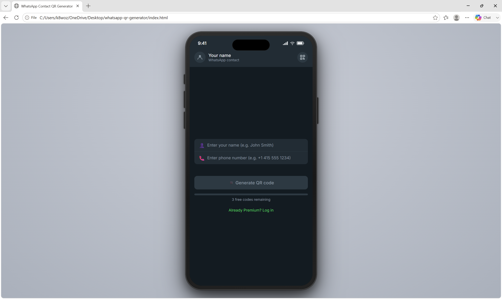
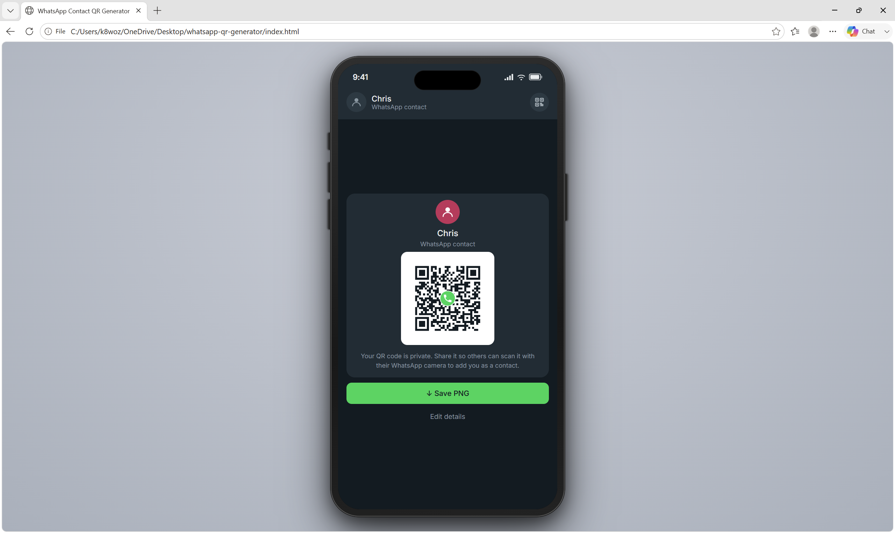

# WhatsApp Contact QR Generator

Portfolio build 1 of 4 in the L2 portfolio.

## Problem

WhatsApp has a built-in QR feature, but it is not easy to use from a desktop browser, export as a clean branded card, or adapt into a freemium product experience. Users need a quick way to generate and save a scannable WhatsApp contact QR without installing another app.

## Solution

The WhatsApp Contact QR Generator is a browser-based tool that creates a `wa.me` deep-link QR code from a name and phone number. It includes a polished WhatsApp-style UI, branded PNG export, and a freemium-to-premium prototype.

## Key Features

- WhatsApp-style dark interface
- Live name preview
- Phone number validation and safe `wa.me` link construction
- QR generation with WhatsApp logo overlay
- Branded PNG card export
- Three-use freemium counter using `localStorage`
- Upgrade screen and premium account mock
- Premium custom QR color controls
- Center logo upload for premium users
- SVG vector export
- Demo reset shortcut for presentations
- Edge-case hardening and secure build checklist documentation

## Tech Stack

- HTML5
- CSS3
- Vanilla JavaScript
- Canvas API
- Hand-built SVG export
- qrcode-generator library through CDN
- Google Fonts
- localStorage for demo state
- Static hosting, no backend required

## My Role / Contribution

I built this group project with Nathan Hutton, focusing on the usable QR generation flow, product logic, freemium behavior, input validation, export experience, demo reset behavior, and documentation of security and edge-case decisions.

## Repo

https://github.com/ChrisWozniak/whatsapp-qr-generator

## Screenshots

### Generator Form

### Generated QR Code Result

