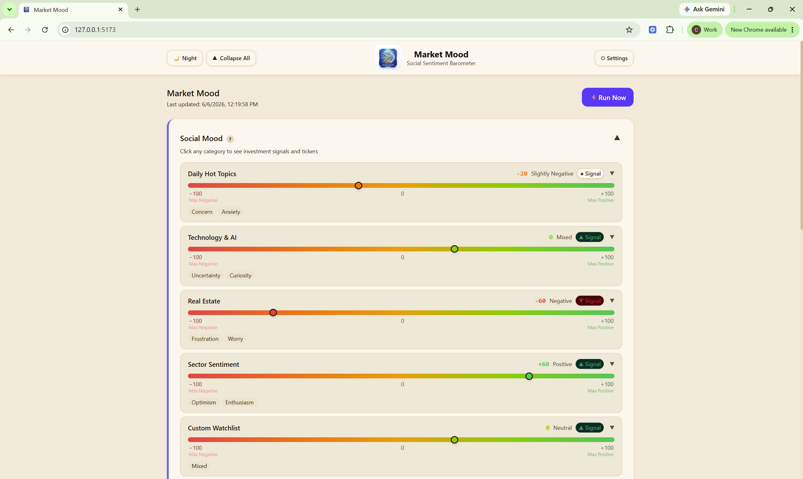
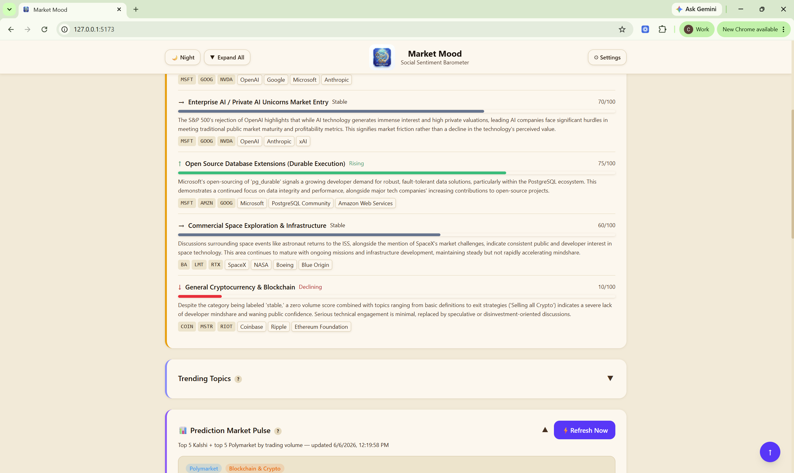

# MarketMood

Portfolio build 2 of 4 in the L2 portfolio.

## Problem

Market research is spread across price movement, social discussion, trend signals, and economic context. A user needs one place to understand market mood, social sentiment, and investment-relevant signals without manually checking many sources.

## Solution

MarketMood is a full-stack dashboard that combines a React frontend with a FastAPI backend. It surfaces market pulse, social sentiment, trending topics, technology momentum, and investment signal views through API-backed dashboard components.

## Core Data Insight

The build was centered on comparing social sentiment with price movement instead of looking at either signal alone. The key insight is that convergence between rising sentiment and rising prices can suggest market momentum, while divergence, such as strong social excitement with weak or falling price action, can flag speculative attention, hype risk, or a signal that needs more evidence before acting.

## Key Features

- React dashboard frontend
- FastAPI backend API
- Health, sentiment, social, signals, and settings routes
- Scheduled social data refresh
- Market pulse and category barometer components
- Trending topics and technology momentum views
- Investment signal components
- Backend service layer for market, Reddit, YouTube, Hacker News, FRED, and Redfin-style data clients
- SQLModel database setup
- Rate limiting and admin-protected schedule update endpoint
- Backend and frontend tests
- GitHub Actions test workflow

## Tech Stack

- React
- TypeScript
- Vite
- Recharts
- Zustand
- Axios
- FastAPI
- SQLModel
- APScheduler
- Uvicorn
- Python
- Pytest
- Vitest
- GitHub Actions

## My Role / Contribution

I worked on a full-stack market intelligence app structure, connecting frontend dashboard components with backend API routes, scheduled refresh logic, service modules, test coverage, and deployment-oriented project organization.

## Repo

https://github.com/ChrisWozniak/MarketMood

## Screenshots

### Market Mood Dashboard

### Market Mood Signals and Market Pulse

