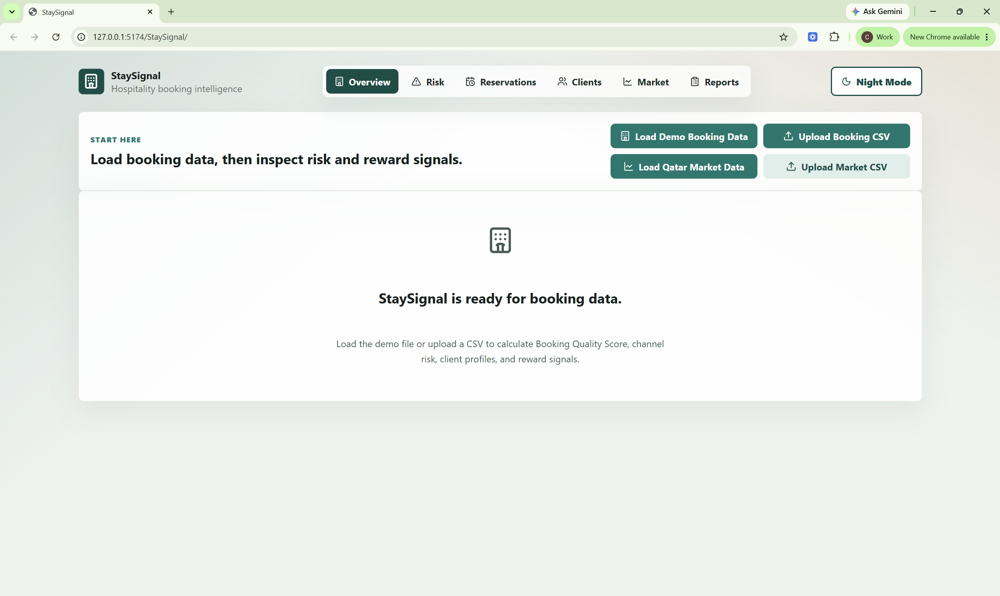
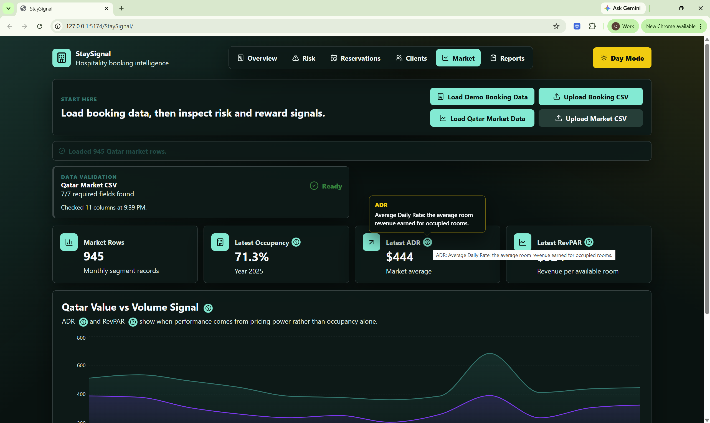

# StaySignal

Portfolio build 3 of 4 in the L2 portfolio.

## Problem

Hotels can look busy based on reservation volume, but not all bookings become completed stays. Management needs a clearer view of cancellation risk, channel reliability, lead-time fragility, client behavior, and market context before making staffing, pricing, and guest-recognition decisions.

## Solution

StaySignal is a frontend hospitality intelligence dashboard that turns booking and market CSV data into operational signals. It helps hotel teams understand booking quality, identify risk, compare channels, review client profiles, and decide what management should do next.

## Observe-Decide-Act Loop

StaySignal observes booking, cancellation, channel, lead-time, client-history, ADR, and market CSV signals; applies scoring logic to classify reservation quality, fulfillment likelihood, client value, and market risk; then recommends management actions such as which reservations to watch, which clients may merit rewards, and where staffing, pricing, or channel strategy needs attention.

## Key Features

- Demo booking data loader and CSV upload flow
- Qatar market data loader and CSV upload flow
- Booking Quality Score from 0 to 100
- Low, medium, and high risk labeling
- Cancellation, channel, lead-time, and ADR analysis
- Reservation-level risk worklist
- Client profile cards with fulfillment behavior
- Reward eligibility recommendations
- Market context view with ADR and RevPAR trends
- Reports view with management summaries and export options
- Day/night visual mode and inline metric help

## Tech Stack

- React
- Vite
- JavaScript
- Papa Parse for CSV parsing
- Recharts for charts
- lucide-react icons
- Browser-side scoring logic
- GitHub Pages-ready static frontend
- Synthetic CSV data for MVP demo use

## My Role / Contribution

I built and shaped the MVP dashboard experience around a practical hospitality operations problem, including data upload, scoring logic, risk interpretation, client-profile views, market context, reporting, and demo-ready product documentation.

## Repo

https://github.com/ChrisWozniak/StaySignal

## Screenshots

### StaySignal Start Screen

### Qatar Market View in Night Mode

