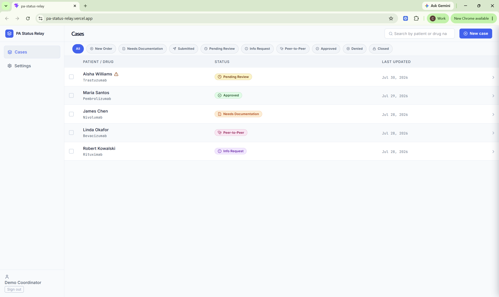
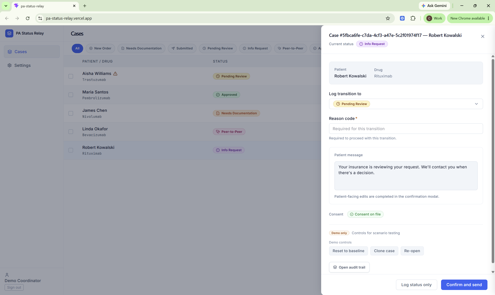

# PA Status Relay

Portfolio build 4 of 4 in the L2 portfolio.

## Problem

Oncology infusion coordinators often rely on manual, disconnected payer portal checks to track prior authorizations. That creates repetitive status work, unclear patient communication, operational delays, and financial risk for infused buy-and-bill drugs.

## Solution

PA Status Relay is a Supabase-backed capstone MVP that demonstrates a coordinator workflow for tracking prior authorization status, previewing patient updates, enforcing consent-aware messaging controls, and preserving audit evidence for every status change.

## Key Features

- Coordinator case list and case-detail workflow
- Nine-status prior authorization state model
- Required metadata gates before certain transitions
- Patient-message preview controls
- Consent-aware communication behavior
- Immutable audit evidence for case transitions
- Synthetic demo scenarios for presentation and QA
- Vercel-hosted app with Supabase-backed API routes

## Tech Stack

- React
- TypeScript
- Vite
- Supabase / Postgres
- Supabase JavaScript client
- Vercel serverless API routes
- GitHub pull request workflow
- Node.js test/build tooling

## My Role / Contribution

I supported the build as part of the development team, helped review and merge pull requests, verified Vercel and Supabase readiness, tested production API behavior, checked repo/GitHub sync, and contributed to demo readiness, team coordination, and technical decision-making.

## Repo

https://github.com/ChrisWozniak/pa-status-relay

## Screenshots

### Case List Dashboard

### Case Detail And Status Transition Drawer

